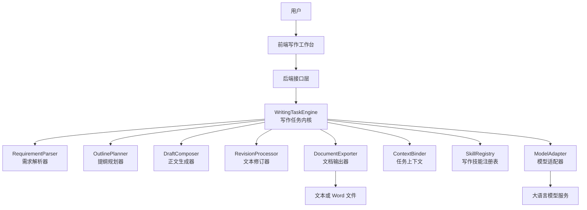
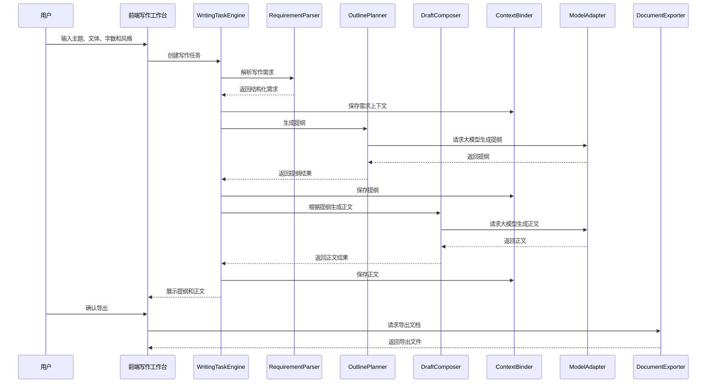
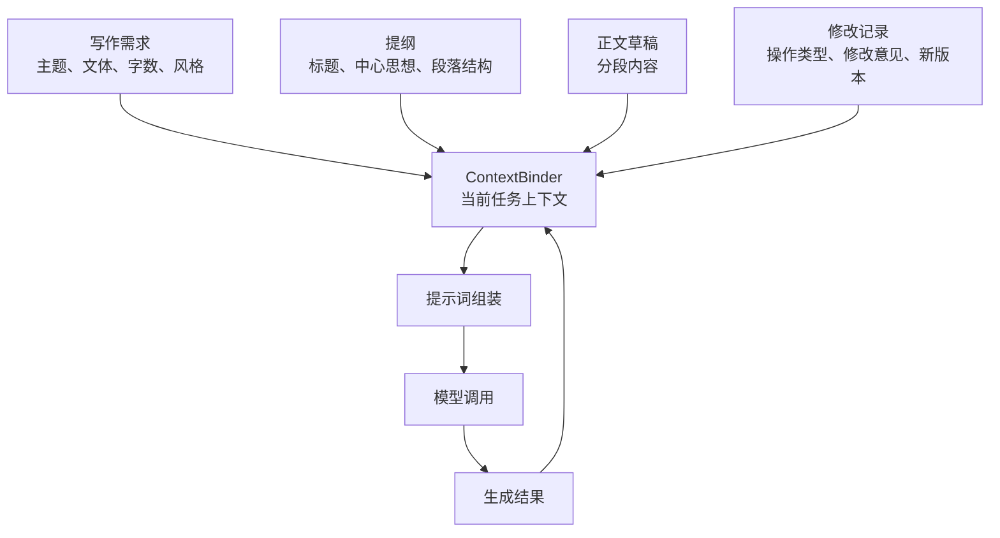

# 基于大模型的文档智能写作助手：系统总体架构设计

## 1. 设计目标

本阶段在需求定位的基础上，给出系统总体架构和核心业务流程。架构设计遵循以下原则：

1. 面向文档写作场景，不扩展为通用智能体平台。
2. 参考 OpenClaw 的任务运行、模型适配、上下文管理和技能模块思想，但在模块名称、职责边界和执行流程上形成差异。
3. 优先保证“题目输入、提纲生成、正文生成、润色修改、文档输出”这一主流程可实现、可演示。
4. 控制一期复杂度，采用单任务内核、单用户上下文和有限写作技能集合。
5. 为后续扩展 Word 导出、模板写作、历史记录和多模型接入保留接口。

## 2. 总体架构

系统采用“前端写作工作台 + 后端写作任务服务 + 大模型能力层”的三层结构。前端负责用户交互，后端负责流程控制和数据组织，大模型层负责文本生成与优化。



## 3. 架构分层说明

### 3.1 前端交互层

前端交互层面向最终用户，主要提供一个写作工作台。用户可以输入写作主题、选择文体、设置字数、选择风格，并查看提纲、正文和修改结果。

主要职责：

1. 收集用户写作需求。
2. 展示提纲和正文内容。
3. 提供生成、润色、扩写、缩写、改写和导出等操作入口。
4. 展示任务状态，例如生成中、已完成、失败提示。
5. 将用户修改意见提交给后端。

建议界面区域：

| 区域 | 功能 |
| --- | --- |
| 左侧需求区 | 输入主题、文体、字数、风格 |
| 中间写作区 | 展示提纲、正文和修改结果 |
| 右侧操作区 | 提供润色、改写、扩写、缩写、导出等按钮 |

### 3.2 后端接口层

后端接口层负责接收前端请求，并调用写作任务内核完成具体业务。它不直接组织复杂写作逻辑，而是把请求转交给 WritingTaskEngine。

主要接口建议：

| 接口 | 作用 |
| --- | --- |
| `/api/task/create` | 创建写作任务 |
| `/api/outline/generate` | 生成文章提纲 |
| `/api/draft/generate` | 根据提纲生成正文 |
| `/api/text/revise` | 润色、改写、扩写或缩写 |
| `/api/document/export` | 导出文档 |
| `/api/task/detail` | 查询当前任务内容 |

### 3.3 写作任务内核层

写作任务内核是系统核心。它承担写作流程调度、上下文维护、技能调用和结果整合职责。

该层不同于 OpenClaw 的通用 Agent Runtime。它不强调自主决策和外部工具执行，而是强调文档写作流程的稳定推进。

核心模块包括：

| 模块 | 中文名称 | 职责 |
| --- | --- | --- |
| WritingTaskEngine | 写作任务引擎 | 统一调度一次写作任务 |
| RequirementParser | 需求解析器 | 将用户输入转为结构化任务 |
| OutlinePlanner | 提纲规划器 | 生成标题、中心思想和段落提纲 |
| DraftComposer | 正文生成器 | 根据提纲生成完整正文 |
| RevisionProcessor | 文本修订器 | 执行润色、改写、扩写、缩写 |
| ContextBinder | 上下文绑定器 | 保存当前任务中的主题、提纲、正文和修改意见 |
| SkillRegistry | 写作技能注册表 | 管理可调用的写作技能 |
| ModelAdapter | 模型适配器 | 封装大模型请求和响应 |
| DocumentExporter | 文档输出器 | 输出文本或 Word 文件 |

### 3.4 大模型能力层

大模型能力层提供实际文本生成能力。系统通过 ModelAdapter 调用大模型，避免业务模块直接依赖某一个模型服务。

主要职责：

1. 接收后端整理好的提示词和参数。
2. 调用指定大模型生成结果。
3. 返回提纲、正文、润色文本或摘要。
4. 处理模型调用异常，例如超时、失败和空结果。

一期可先支持一种模型调用方式，后续再扩展多模型配置。

### 3.5 数据与文件层

数据与文件层用于保存任务内容和导出结果。一期可以采用轻量化设计，不必引入复杂数据库。

建议保存内容：

| 数据对象 | 说明 |
| --- | --- |
| WritingTask | 一次写作任务的基本信息 |
| WritingRequirement | 结构化写作需求 |
| Outline | 生成的提纲 |
| Draft | 正文草稿 |
| RevisionRecord | 润色或改写记录 |
| ExportFile | 导出的文本或 Word 文件 |

## 4. 主业务流程

主业务流程从用户输入开始，经过需求解析、提纲规划、正文生成和结果输出，最终形成可保存的文档内容。



## 5. 文本修订流程

文本修订是系统的重要功能。用户可以对已生成正文发起润色、改写、扩写、缩写或按意见修改。


修订类型建议包括：

| 修订类型 | 说明 |
| --- | --- |
| polish | 润色语言，使表达更自然 |
| rewrite | 改写内容，改变表达方式 |
| expand | 扩写内容，增加论述和细节 |
| shorten | 缩写内容，压缩篇幅 |
| correct | 修正语病、错别字和不通顺表达 |
| custom | 按用户自定义意见修改 |

## 6. 上下文数据流

上下文管理不采用复杂长期记忆，而是围绕当前写作任务保存必要信息。



上下文建议字段：

| 字段 | 说明 |
| --- | --- |
| taskId | 任务编号 |
| topic | 写作主题 |
| genre | 文体类型 |
| wordCount | 目标字数 |
| style | 写作风格 |
| outline | 当前提纲 |
| draft | 当前正文 |
| revisions | 历史修订记录 |
| status | 任务状态 |
| createdAt | 创建时间 |
| updatedAt | 更新时间 |

## 7. 写作技能设计

写作技能是对具体写作能力的封装。和 OpenClaw 的通用技能不同，本系统技能只服务于文档生成和文本优化。

一期建议保留以下技能：

| 技能 | 功能 |
| --- | --- |
| TitleSkill | 根据主题生成标题 |
| OutlineSkill | 生成文章提纲 |
| DraftSkill | 生成正文 |
| PolishSkill | 润色文本 |
| RewriteSkill | 改写文本 |
| ExpandSkill | 扩写文本 |
| ShortenSkill | 缩写文本 |
| SummarySkill | 生成摘要 |

技能调用方式建议统一为：

```text
输入：结构化任务上下文 + 用户操作类型
处理：组装提示词并调用模型
输出：结构化结果，例如标题、提纲、正文或修订文本
```

## 8. 与 OpenClaw 架构差异

| 对比项 | OpenClaw 思路 | 本系统设计 |
| --- | --- | --- |
| 系统定位 | 通用智能体平台 | 文档写作助手 |
| 运行核心 | Agent Runtime | WritingTaskEngine |
| 任务目标 | 自动执行多类型任务 | 推进写作流程 |
| 工具调用 | 可连接多类外部工具 | 仅保留写作相关技能 |
| 记忆机制 | 可支持长期记忆 | 当前文档任务上下文 |
| 技能体系 | 泛化技能和插件 | 文档写作技能 |
| 交互渠道 | 多渠道消息接入 | Web 写作工作台 |
| 安全边界 | 需要管理外部执行风险 | 默认不开放高风险执行能力 |

## 9. 推荐技术结构

为了便于快速完成项目，一期可以采用前后端分离或轻量全栈结构。

推荐方案：

| 层级 | 技术建议 | 说明 |
| --- | --- | --- |
| 前端 | Vue 或 React | 实现写作工作台 |
| 后端 | Python FastAPI 或 Node.js Express | 提供接口和任务调度 |
| 模型调用 | OpenAI 兼容接口或本地模型接口 | 通过 ModelAdapter 统一封装 |
| 数据存储 | JSON 文件或 SQLite | 一期保存任务和修订记录 |
| 文档导出 | python-docx 或 docx 模板 | 导出 Word 文档 |

如果以完成度和实现难度为优先，建议采用：

```text
前端：Vue
后端：Python FastAPI
存储：SQLite 或 JSON
文档导出：python-docx
模型接口：OpenAI 兼容接口
```

## 10. 一期实现闭环

根据本架构，一期项目实现闭环如下：

1. 用户在前端输入写作要求。
2. 后端创建写作任务。
3. RequirementParser 解析需求。
4. OutlinePlanner 生成提纲。
5. DraftComposer 生成正文。
6. RevisionProcessor 支持润色和改写。
7. ContextBinder 保存当前任务内容。
8. DocumentExporter 导出最终结果。

该闭环覆盖项目演示所需的主要功能，也能在论文中对应“需求分析、系统设计、核心算法/方法、系统实现、测试验证”等章节。

## 11. 后续阶段衔接

完成总体架构后，下一阶段应进入“轻量化写作任务内核设计”，重点细化以下内容：

1. WritingTaskEngine 的内部执行机制。
2. ContextBinder 的上下文字段和状态流转。
3. SkillRegistry 的技能注册与调用方式。
4. ModelAdapter 的请求格式和错误处理。
5. 提纲生成、正文生成、润色修改的提示词模板。

## 12. 阶段结论

本系统总体架构采用轻量化分层设计，将复杂通用智能体能力缩减为文档写作任务流程。系统保留 OpenClaw 中“任务运行、技能调用、上下文管理、模型适配”的思想，但将其重构为面向作文和文档生成的专用架构。该设计既能够保证项目实现可控，也能够在论文中清楚体现参考、改造和创新之间的关系。
