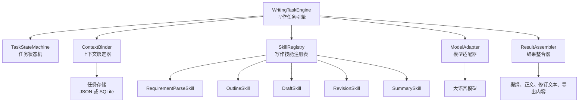
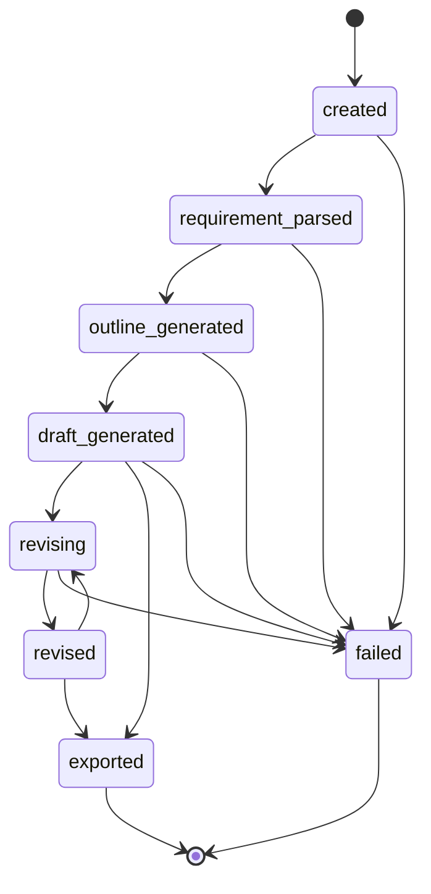

# 基于大模型的文档智能写作助手：轻量化写作任务内核设计

## 1. 内核设计目标

轻量化写作任务内核是本系统区别于普通大模型问答系统的核心部分。它的作用不是简单地把用户输入直接交给大模型，而是将一次文档写作请求拆解为多个可控制、可复用、可追踪的写作步骤。

本内核参考 OpenClaw 的任务运行、上下文维护、技能调用和模型适配思想，但进行明显缩减和改造：

1. 不构建通用 Agent Runtime，只构建文档写作专用的 WritingTaskEngine。
2. 不提供任意工具调用，只调用固定范围内的写作技能。
3. 不维护复杂长期记忆，只维护当前写作任务上下文。
4. 不进行开放式自主规划，只按照文档写作流程进行有限编排。
5. 不追求多智能体协作，只采用单任务引擎加多写作技能的模式。

内核最终要解决的问题是：

> 如何让“写一篇文章”从一次不可控的大模型生成，变成一个有状态、有流程、有技能分工的写作任务。

## 2. 内核总体结构

轻量化写作任务内核由五类核心组件组成：



核心组件说明：

| 组件 | 职责 |
| --- | --- |
| WritingTaskEngine | 负责统一推进写作任务流程 |
| TaskStateMachine | 管理任务状态变化 |
| ContextBinder | 保存和读取当前任务上下文 |
| SkillRegistry | 管理可调用写作技能 |
| ModelAdapter | 封装大模型调用 |
| ResultAssembler | 整合提纲、正文和修订结果 |

其中 WritingTaskEngine 是总控模块，其他组件均由它调度。

## 3. 任务状态设计

写作任务应具备明确状态，方便前端展示、后端控制和异常恢复。

建议状态如下：

| 状态 | 含义 |
| --- | --- |
| created | 任务已创建 |
| requirement_parsed | 需求已解析 |
| outline_generated | 提纲已生成 |
| draft_generated | 正文已生成 |
| revising | 正在修订 |
| revised | 修订完成 |
| exported | 文档已导出 |
| failed | 任务失败 |

状态流转如下：



状态设计体现了本系统的差异性：它不是让智能体自由决定下一步，而是围绕文档写作流程进行受控推进。

## 4. WritingTaskEngine 设计

WritingTaskEngine 是内核入口。前端或接口层不直接调用具体技能，而是通过任务引擎提交操作。

核心职责：

1. 创建写作任务。
2. 调用需求解析器生成结构化需求。
3. 调用提纲技能生成提纲。
4. 调用正文技能生成草稿。
5. 调用修订技能处理润色、改写、扩写和缩写。
6. 更新上下文和任务状态。
7. 统一处理异常和返回结果。

建议对外方法：

| 方法 | 说明 |
| --- | --- |
| createTask(input) | 创建任务并保存原始需求 |
| parseRequirement(taskId) | 解析写作需求 |
| generateOutline(taskId) | 生成提纲 |
| generateDraft(taskId) | 生成正文 |
| reviseText(taskId, revisionType, instruction) | 修订正文 |
| exportDocument(taskId, format) | 导出文档 |
| getTask(taskId) | 查询任务详情 |

建议执行逻辑：

```text
1. 接收任务请求。
2. 从 ContextBinder 中读取当前上下文。
3. 根据操作类型选择对应写作技能。
4. 调用 SkillRegistry 获取技能实例。
5. 技能根据上下文组装提示词。
6. 通过 ModelAdapter 调用大模型。
7. 将模型结果交给 ResultAssembler 整理。
8. 更新上下文和任务状态。
9. 返回结构化结果给接口层。
```

## 5. ContextBinder 设计

ContextBinder 负责管理当前任务中的所有上下文。它相当于写作任务的“工作记忆”，但不是 OpenClaw 式的长期记忆系统。

上下文结构建议如下：

```json
{
  "taskId": "task_202606011900001",
  "status": "draft_generated",
  "requirement": {
    "topic": "人工智能对学习方式的影响",
    "genre": "议论文",
    "wordCount": 800,
    "style": "正式、逻辑清晰",
    "audience": "学生",
    "extraInstruction": "观点积极，结合现实例子"
  },
  "outline": {
    "title": "人工智能正在改变学习方式",
    "thesis": "人工智能提升了学习效率，但也要求学习者保持主动思考。",
    "sections": [
      {
        "heading": "引言",
        "points": ["引出人工智能进入教育场景", "提出中心观点"]
      },
      {
        "heading": "主体一",
        "points": ["个性化学习", "学习资源获取更便捷"]
      },
      {
        "heading": "主体二",
        "points": ["过度依赖的问题", "保持独立思考的重要性"]
      },
      {
        "heading": "结尾",
        "points": ["总结观点", "提出合理使用建议"]
      }
    ]
  },
  "draft": {
    "content": "正文内容",
    "version": 1
  },
  "revisions": [
    {
      "revisionType": "polish",
      "instruction": "语言更自然",
      "beforeVersion": 1,
      "afterVersion": 2,
      "createdAt": "2026-06-01 19:00:00"
    }
  ],
  "createdAt": "2026-06-01 19:00:00",
  "updatedAt": "2026-06-01 19:05:00"
}
```

ContextBinder 的主要方法：

| 方法 | 说明 |
| --- | --- |
| createContext(input) | 创建任务上下文 |
| getContext(taskId) | 获取任务上下文 |
| updateRequirement(taskId, requirement) | 更新结构化需求 |
| updateOutline(taskId, outline) | 更新提纲 |
| updateDraft(taskId, draft) | 更新正文 |
| addRevision(taskId, revisionRecord) | 增加修订记录 |
| updateStatus(taskId, status) | 更新任务状态 |

## 6. SkillRegistry 设计

SkillRegistry 用于管理写作技能。所有技能必须符合统一调用规范，避免后续模块混乱。

统一技能接口建议：

```text
skill.name: 技能名称
skill.description: 技能说明
skill.input: 任务上下文 + 用户指令
skill.execute(context, instruction): 执行技能
skill.output: 结构化结果
```

一期技能列表：

| 技能名称 | 输入 | 输出 |
| --- | --- | --- |
| RequirementParseSkill | 原始用户输入 | 结构化写作需求 |
| OutlineSkill | 写作需求 | 标题、中心思想、段落提纲 |
| DraftSkill | 写作需求 + 提纲 | 正文草稿 |
| PolishSkill | 正文 + 风格要求 | 润色后正文 |
| RewriteSkill | 正文 + 改写要求 | 改写后正文 |
| ExpandSkill | 正文 + 扩写要求 | 扩写后正文 |
| ShortenSkill | 正文 + 字数要求 | 缩写后正文 |
| SummarySkill | 正文 | 摘要 |

技能调用流程：


该设计保留了 OpenClaw 的技能模块思想，但技能不面向通用工具执行，而是面向文档写作能力。

## 7. ModelAdapter 设计

ModelAdapter 统一负责模型调用，避免业务模块直接绑定具体模型。

主要职责：

1. 统一模型请求格式。
2. 统一设置模型参数，例如温度、最大输出长度。
3. 处理模型返回结果。
4. 捕获调用异常。
5. 支持后续切换不同模型。

建议请求结构：

```json
{
  "model": "model-name",
  "messages": [
    {
      "role": "system",
      "content": "你是一个文档写作助手。"
    },
    {
      "role": "user",
      "content": "请根据以下要求生成文章提纲..."
    }
  ],
  "temperature": 0.7,
  "maxTokens": 2000
}
```

建议响应结构：

```json
{
  "success": true,
  "content": "模型返回文本",
  "usage": {
    "promptTokens": 100,
    "completionTokens": 500
  },
  "error": null
}
```

异常处理策略：

| 异常 | 处理方式 |
| --- | --- |
| 模型超时 | 返回失败提示，允许重试 |
| 返回为空 | 重新调用一次或提示用户修改输入 |
| 输出格式错误 | 尝试解析修复，失败则返回原始文本 |
| 接口认证失败 | 返回配置错误提示 |
| 内容过长 | 分段生成或提示缩短输入 |

## 8. ResultAssembler 设计

ResultAssembler 负责把模型输出整理为系统可用结果。大模型输出可能包含多余解释、格式不稳定或段落边界不清晰，因此需要进行轻量处理。

主要职责：

1. 清理模型输出中的多余说明。
2. 将提纲结果整理为标题、中心思想和段落列表。
3. 将正文结果整理为分段文本。
4. 将修订结果保存为新版本。
5. 为导出模块提供标准化内容。

注意：该模块只做轻量结构化处理，不进行复杂语义改写，避免引入不必要的实现难度。

## 9. 提示词模板设计

提示词模板是写作技能稳定输出的关键。一期可以先使用固定模板，后续再扩展模板库。

### 9.1 需求解析模板

```text
你是一个写作需求分析助手。请从用户输入中提取写作任务信息，并按指定字段输出。

用户输入：
{user_input}

请提取：
1. 写作主题
2. 文体类型
3. 目标字数
4. 写作风格
5. 面向读者
6. 其他要求

如果某项没有明确给出，请根据语境合理补全，并标记为“推断”。
```

### 9.2 提纲生成模板

```text
你是一个文档写作规划助手。请根据以下写作要求生成清晰的文章提纲。

主题：{topic}
文体：{genre}
目标字数：{word_count}
写作风格：{style}
其他要求：{extra_instruction}

请输出：
1. 推荐标题
2. 中心思想
3. 段落结构
4. 每段写作要点

要求：
- 提纲结构要适合指定文体。
- 段落数量要适合目标字数。
- 不要直接生成完整正文。
```

### 9.3 正文生成模板

```text
你是一个文档正文生成助手。请根据写作要求和提纲生成完整正文。

写作要求：
主题：{topic}
文体：{genre}
目标字数：{word_count}
写作风格：{style}

提纲：
{outline}

生成要求：
- 正文要紧扣主题。
- 段落之间要自然衔接。
- 内容要符合指定文体。
- 字数尽量接近目标字数。
- 不要输出提纲说明，只输出正文。
```

### 9.4 润色模板

```text
你是一个中文文本润色助手。请在不改变原意的基础上优化下面的正文。

原文：
{draft}

润色要求：
{instruction}

请优化：
- 语句通顺度
- 表达自然度
- 段落连贯性
- 用词准确性

不要添加与主题无关的新内容。
```

### 9.5 改写模板

```text
你是一个中文文本改写助手。请根据用户要求改写下面的正文。

原文：
{draft}

改写要求：
{instruction}

要求：
- 保留核心观点。
- 改变表达方式和句式结构。
- 保持文体一致。
- 输出完整改写后的正文。
```

## 10. 内核执行模式

一期建议支持两种执行模式：

| 模式 | 说明 |
| --- | --- |
| 分步执行 | 用户先生成提纲，确认后再生成正文 |
| 一键执行 | 系统自动完成需求解析、提纲生成和正文生成 |

分步执行适合演示系统的可控性，一键执行适合提升使用效率。

分步执行流程：

```text
创建任务 -> 解析需求 -> 生成提纲 -> 用户确认 -> 生成正文 -> 用户修订 -> 导出文档
```

一键执行流程：

```text
创建任务 -> 解析需求 -> 生成提纲 -> 生成正文 -> 返回完整结果
```

建议一期优先实现分步执行，因为它更能体现“写作任务内核”的过程控制能力。

## 11. 安全与边界控制

为了与通用智能体平台形成差异，并降低实现风险，本内核应设置明确边界：

1. 只允许调用写作技能，不允许执行任意外部工具。
2. 模型输出必须返回给用户确认，不自动发布或提交。
3. 当前任务上下文只保存写作相关信息。
4. 导出文件只基于用户当前确认内容生成。
5. 对异常输入提供提示，不让任务进入不可控循环。

这些边界能够体现系统是“辅助写作工具”，而不是开放式自动代理。

## 12. 与 OpenClaw 内核思想的对照

| OpenClaw 内核思想 | 本系统吸收方式 | 本系统差异化改造 |
| --- | --- | --- |
| Agent 运行时 | 任务引擎统一调度 | 改为 WritingTaskEngine，不做开放式 Agent |
| Tool/Skill 调用 | 使用技能注册表 | 仅注册写作技能，不接入通用工具 |
| Memory 管理 | 保存上下文 | 只保存当前文档任务上下文 |
| Model Provider | 模型适配器 | 只服务文本生成、提纲和润色 |
| Workflow 编排 | 按步骤执行任务 | 固定为写作流程，不做复杂自主规划 |
| 多场景扩展 | 模块化设计 | 聚焦作文和文档生成 |

## 13. 后续代码实现建议

后续进入实现阶段时，可以按以下目录设计：

```text
backend/
  app/
    main.py
    api/
      task_api.py
      writing_api.py
      export_api.py
    core/
      writing_task_engine.py
      task_state.py
      context_binder.py
      skill_registry.py
      model_adapter.py
      result_assembler.py
    skills/
      requirement_parse_skill.py
      outline_skill.py
      draft_skill.py
      revision_skill.py
      summary_skill.py
    storage/
      task_store.py
    exporter/
      document_exporter.py
```

优先实现顺序：

1. ContextBinder 和任务存储。
2. ModelAdapter。
3. RequirementParseSkill。
4. OutlineSkill。
5. DraftSkill。
6. RevisionSkill。
7. WritingTaskEngine。
8. 后端接口。

## 14. 阶段结论

轻量化写作任务内核通过 WritingTaskEngine、ContextBinder、SkillRegistry、ModelAdapter 和 ResultAssembler 等模块，把文档写作过程拆解为有状态、可控制、可复用的任务流程。它保留了 OpenClaw 中任务运行和模块化调用的思想，但删除了通用智能体中复杂的外部工具、长期记忆和自主代理能力，使系统更加聚焦于作文和文档生成场景。

该内核设计完成后，后续即可进入核心后端功能实现阶段。
